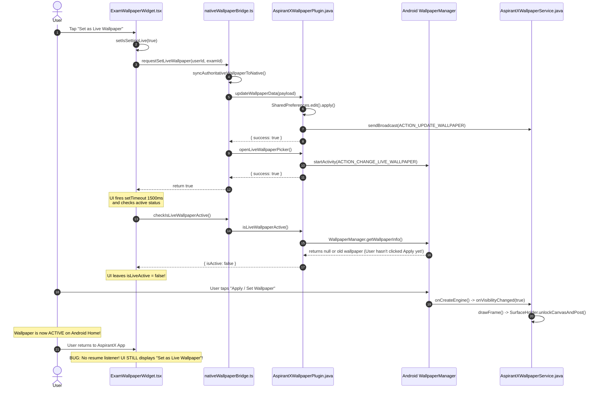

# ASPIRANTX — CURRENT LIVE DYNAMIC WALLPAPER FORENSIC AUDIT
**Document Type:** Technical Forensic Analysis (Phase 1 Deliverable)  
**Target:** Android Native & React PWA Live Wallpaper Mechanism  
**Date:** 2026-09-04  

---

## 1. Trace of Existing Components

The current wallpaper architecture spans 7 layers across TypeScript and Android Java:

```text
[ React UI: ExamWallpaperWidget.tsx ]
       │
       ▼
[ TS Bridge: nativeWallpaperBridge.ts ]
       │  (Capacitor Plugin Call: AspirantXWallpaper)
       ▼
[ Native Plugin: AspirantXWallpaperPlugin.java ]
       ├── SharedPreferences: aspirantx_live_wallpaper_prefs.xml
       ├── Intent: WallpaperManager.ACTION_CHANGE_LIVE_WALLPAPER
       └── Broadcast: com.aspirantx.app.ACTION_UPDATE_WALLPAPER
               │
               ▼
[ Android Manifest: AndroidManifest.xml ]
       ├── android.service.wallpaper.WallpaperService (BIND_WALLPAPER)
       └── res/xml/wallpaper.xml (Metadata description & settingsActivity)
               │
               ▼
[ Wallpaper Service: AspirantXWallpaperService.java ]
       ├── AspirantXEngine (extends WallpaperService.Engine)
       ├── BroadcastReceiver (ACTION_UPDATE_WALLPAPER, TIME_TICK, DATE_CHANGED)
       └── Canvas Renderer (Draws directly to SurfaceHolder)
```

### Component Details
1. **`src/components/ExamWallpaperWidget.tsx` (833 lines)**:
   - Primary user interface for wallpaper customization, persona selection, and wallpaper actions.
   - Maintains local state: `telemetry`, `selectedPersona`, `isLiveActive`, `isSettingLive`, `isGeneratingWallpaper`.
   - Contains a simulated `aspirantx_wallpaper_permission` flag in `localStorage` that is disconnected from Android.
   - Houses a 1080x2400 HTML5 2D Canvas static wallpaper exporter.
2. **`src/lib/nativeWallpaperBridge.ts` (121 lines)**:
   - Registers `@capacitor/core` plugin interface `AspirantXWallpaper`.
   - Exposes:
     - `syncAuthoritativeWallpaperToNative(userId, examId)`: builds payload and calls plugin `updateWallpaperData`.
     - `requestSetLiveWallpaper(userId, examId)`: syncs data, then calls plugin `openLiveWallpaperPicker`.
     - `checkIsLiveWallpaperActive()`: calls plugin `isLiveWallpaperActive`.
3. **`android/app/src/main/java/com/aspirantx/app/AspirantXWallpaperPlugin.java` (126 lines)**:
   - Capacitor native plugin registered in `MainActivity.java`.
   - Exposes `@PluginMethod updateWallpaperData`, `openLiveWallpaperPicker`, and `isLiveWallpaperActive`.
   - Reads options from `PluginCall` and writes to `AspirantXWallpaperService.PREFS_NAME` (`aspirantx_live_wallpaper_prefs`).
   - Dispatches broadcast `com.aspirantx.app.ACTION_UPDATE_WALLPAPER`.
4. **`android/app/src/main/AndroidManifest.xml` (lines 46–58)**:
   - Declares `.AspirantXWallpaperService` with permission `android.permission.BIND_WALLPAPER`.
   - Intent filter with action `android.service.wallpaper.WallpaperService`.
   - Meta-data referencing `@xml/wallpaper`.
5. **`android/app/src/main/res/xml/wallpaper.xml`**:
   - Declares thumbnail `@mipmap/ic_launcher` and `settingsActivity="com.aspirantx.app.MainActivity"`.
6. **`android/app/src/main/java/com/aspirantx/app/AspirantXWallpaperService.java` (420 lines)**:
   - Implements `WallpaperService` and inner `AspirantXEngine extends Engine`.
   - Surface lifecycle: `onCreate`, `onDestroy`, `onVisibilityChanged`, `onSurfaceChanged`, `onSurfaceDestroyed`.
   - Direct 2D hardware-accelerated Canvas rendering via `SurfaceHolder.lockCanvas()`.
   - Renders: Background gradient, Exam title, Target date, Countdown pill, Syllabus % card, Active streak card, 28-day study habit calendar matrix.

---

## 2. Current Runtime Flow



---

## 3. Where the Current Flow Breaks

1. **Premature Active State Polling**:
   - `requestSetLiveWallpaper` immediately launches the Android Preview Activity.
   - The React UI invokes a single `setTimeout(..., 1500)` to query `isLiveWallpaperActive()`.
   - Because the user is physically on the Android system preview screen at second 1.5, `getWallpaperInfo()` still returns the previous wallpaper. The poll fails, and no subsequent checks ever run.
2. **Missing App Lifecycle / Resume Listener**:
   - When the user presses "Set Wallpaper" on the Android system screen and taps the Back or Home button to return to AspirantX, the app never listens for `@capacitor/app` `appStateChange` or window focus.
   - Consequently, the UI remains permanently in the inactive "Set as Live Wallpaper" state even though the live wallpaper is actively running on the device.
3. **Theming & Persona Disconnect (Data Siloing)**:
   - The user can select from 7 personas in `ExamWallpaperWidget` (e.g., Solo Shadow, Will of Fire, Ashoka Vanguard).
   - The static PNG generator reads `selectedPersona.bgGradient`, `selectedPersona.characterQuote`, `selectedPersona.accentColor`.
   - However, `WallpaperDataPayload` in `nativeWallpaperBridge.ts` **omits** all persona data.
   - As a result, `AspirantXWallpaperService.java` renders with hardcoded deep-space colors (`#040714`, `#080E24`) and ignores user persona selection entirely.
4. **No Direct Event Trigger on Theme Change**:
   - Tapping a persona card updates `localStorage` but does not trigger `syncAuthoritativeWallpaperToNative()`. Even if the service supported themes, changing a theme never sends an update to the native wallpaper.
5. **No State Machine on UI**:
   - The UI button has only a binary toggle (`isLiveActive ? 'Live Wallpaper Active' : 'Set as Live Wallpaper'`).
   - It lacks intermediate states: `NOT_SUPPORTED`, `READY`, `PREVIEW_OPENED`, `ACTIVE`, `INACTIVE`, `REPLACED`.
   - When active, there is no "Manage Wallpaper" or "Re-sync" button.
6. **Battery Waste via `ACTION_TIME_TICK`**:
   - `AspirantXWallpaperService` registers `Intent.ACTION_TIME_TICK`, which causes a complete canvas redraw **every 60 seconds** when visible, despite the wallpaper displaying only day-level countdown and habit progress.
