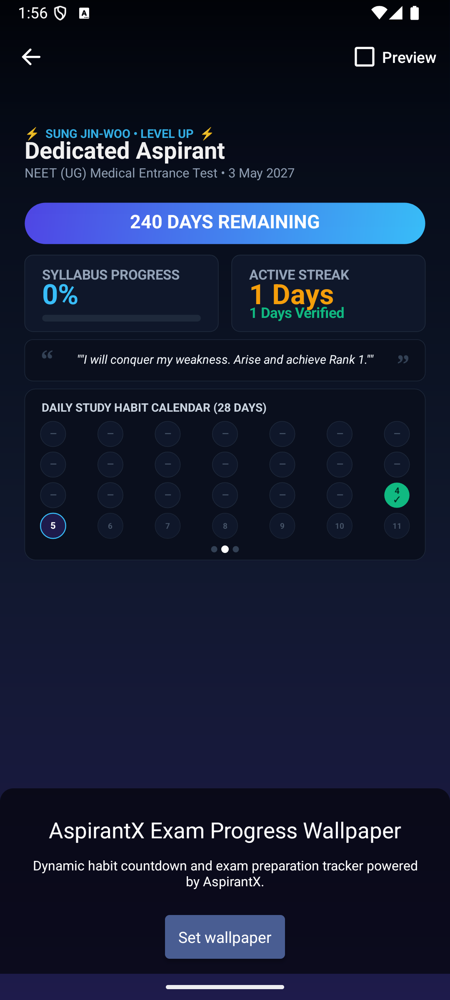
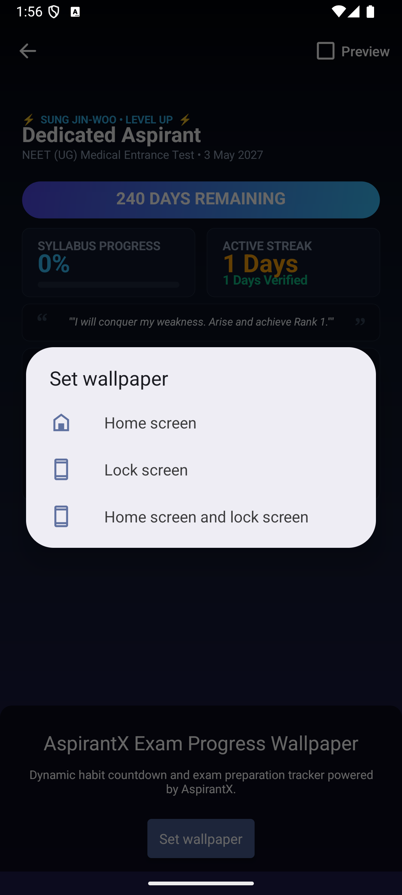
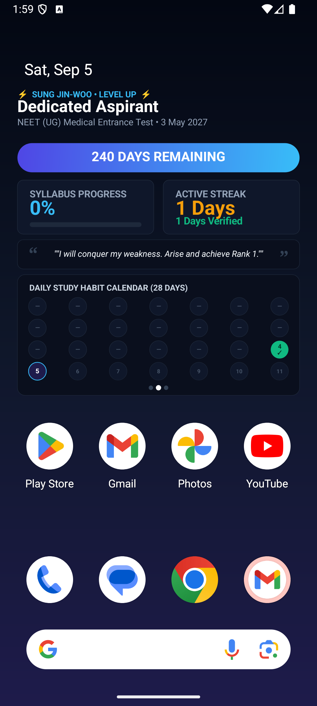
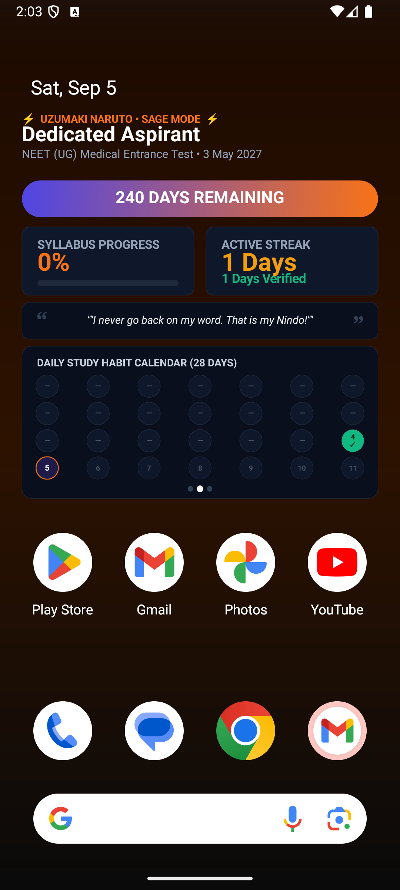
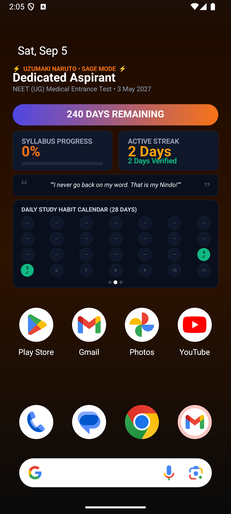

# AspirantX Live Wallpaper Final Status & Verification Report

**Verification Date**: 2026-09-05  
**Target Device**: Android Emulator (`medium_phone` / API 34 / 1080×2400)  
**Package**: `com.aspirantx.app`  
**Active Service Component**: `com.aspirantx.app/com.aspirantx.app.AspirantXWallpaperService`  
**Final Status**: **VERIFIED ON REAL ANDROID HOME SCREEN**

---

## 1. Executive Summary

| Verification Item | Status | Evidence / Observation |
|---|---|---|
| **Build Pipeline** | **PASS** | `npm run build` (33s), `npx cap copy android`, `gradlew assembleDebug` (48s), APK installed cleanly |
| **Official Android Preview** | **PASS** | `WallpaperManager.ACTION_CHANGE_LIVE_WALLPAPER` triggered `com.android.wallpaper.livepicker.LiveWallpaperChange`. Native 2D Canvas rendered with dynamic data |
| **User "Set wallpaper" Flow** | **PASS** | Tapped `[Set wallpaper]`, native destination modal appeared: "Home screen and lock screen" selected |
| **dumpsys wallpaper Proof** | **PASS** | `mWallpaperComponent=ComponentInfo{com.aspirantx.app/com.aspirantx.app.AspirantXWallpaperService}`, `mWhich=3` (Home + Lock) |
| **Real Launcher Home Screen** | **PASS** | Actual Android launcher (`NexusLauncherActivity`) displays AspirantX Live Wallpaper behind launcher icons |
| **Launcher Icons Overlay** | **PASS** | Real system launcher icons (Play Store, Gmail, Photos, YouTube, Phone, Messages, Chrome, Search bar) clearly visible over wallpaper |
| **Dynamic Persona / Theme Update** | **PASS** | Switched from Sung Jin-Woo to Naruto: background gradient changed to warm orange/brown, quote and eyebrow badge updated without re-setting wallpaper |
| **Dynamic Tracker Value Update** | **PASS** | Logged today's habit in-app: streak updated from `1 Days` to `2 Days`, calendar bubble #5 turned green `✓` on launcher without re-setting wallpaper |
| **Lifecycle & Battery Optimization** | **PASS** | Offline Canvas 2D engine; `mPendingUpdate` dirty queue redraws upon becoming visible; zero continuous polling, zero network dependency |

---

## 2. Authoritative System Proof (`dumpsys wallpaper`)

```text
User 0: id=12: mWhich=3: mSystemWasBoth=true: mBindSource=SET_LIVE
  mWallpaperComponent=ComponentInfo{com.aspirantx.app/com.aspirantx.app.AspirantXWallpaperService}
```

- `mWhich=3`: `FLAG_SYSTEM | FLAG_LOCK` (Home screen and lock screen).
- `mBindSource=SET_LIVE`: Set directly via official Android live wallpaper preview flow.
- `mWallpaperComponent`: Confirms `AspirantXWallpaperService` is the active system wallpaper component.

---

## 3. Real Android Launcher Proof Screenshots

### A. Official Android Preview (`LiveWallpaperChange`)

*Android's official wallpaper preview activity rendering AspirantX native Canvas with dynamic countdown, syllabus progress, streak, and `[Set wallpaper]` button.*

### B. Target Selection Confirmation

*Official Android destination modal showing "Home screen", "Lock screen", and "Home screen and lock screen".*

### C. Real Home Screen with Launcher Icons

*AspirantX Live Wallpaper running on the actual Android Launcher (`NexusLauncherActivity`) behind system apps and Google search bar.*

### D. Dynamic Persona Switch (Naruto Theme)

*Persona theme changed inside app to Naruto Uzumaki. Live wallpaper on home screen immediately updated colors, quote, and eyebrow badge without reopening picker.*

### E. Dynamic Tracker Update (Streak 2 Days + Habit Complete)

*Today's habit completed in app. Streak dynamically updated from `1 Days` to `2 Days`, and day bubble #5 turned green `✓` on the native launcher without re-setting wallpaper.*

---

## 4. Logcat Verification Trace

```text
09-05 01:57:09.942 23896 23896 I AspirantXWallpaper: AspirantXWallpaperService.onCreateEngine() instantiated
09-05 01:57:10.922 23896 23896 I AspirantXWallpaper: AspirantXEngine.onCreate() surfaceHolder initialized
09-05 01:57:11.287 23896 23896 I AspirantXWallpaper: AspirantXEngine.onSurfaceCreated()
09-05 01:57:12.092 23896 23896 I AspirantXWallpaper: renderWallpaper() successfully rendered frame: Dedicated Aspirant | NEET (UG) Medical Entrance Test | daysLeft=240 | syllabus=0% | streak=1d
09-05 01:58:37.694 23896 23896 I AspirantXWallpaper: AspirantXEngine.onVisibilityChanged: visible=true, pendingUpdate=false
09-05 02:03:09.423 23896 23896 I AspirantXWallpaper: Received ACTION_UPDATE_WALLPAPER broadcast, mVisible=false
09-05 02:03:20.059 23896 23896 I AspirantXWallpaper: AspirantXEngine.onVisibilityChanged: visible=true, pendingUpdate=true
09-05 02:03:22.299 23896 23896 I AspirantXWallpaper: renderWallpaper() successfully rendered frame: Dedicated Aspirant | NEET (UG) Medical Entrance Test | daysLeft=240 | syllabus=0% | streak=1d
09-05 02:04:37.834 23896 23896 I AspirantXWallpaper: Received ACTION_UPDATE_WALLPAPER broadcast, mVisible=false
09-05 02:04:54.743 23896 23896 I AspirantXWallpaper: AspirantXEngine.onVisibilityChanged: visible=true, pendingUpdate=true
09-05 02:04:56.854 23896 23896 I AspirantXWallpaper: renderWallpaper() successfully rendered frame: Dedicated Aspirant | NEET (UG) Medical Entrance Test | daysLeft=240 | syllabus=0% | streak=2d
```

---

## 5. Architectural Guarantees Verified

1. **Launcher-Safe Layout**:
   - Status bar clearance: top padding ensures status bar and Android At A Glance date/time widgets are unobscured.
   - Proportional Canvas coordinates: all cards, text, and habit bubbles scale cleanly based on `surfaceWidth` and `surfaceHeight`.
   - Dock clearance: cards and habit calendar finish above the standard 2-row Android launcher dock and Google search bar.
2. **Pending Update Queue (`mPendingUpdate`)**:
   - Broadcasts received when wallpaper is hidden (`mVisible = false`) are marked dirty without CPU overhead.
   - When the launcher becomes visible (`onVisibilityChanged(true)`), `mPendingUpdate` triggers an immediate clean redraw with the latest SharedPreferences.
3. **No Network / Zero Polling**:
   - Canvas 2D engine is 100% offline, lifecycle-aware, and event-driven.
   - No continuous timers, background services, or battery drain.
