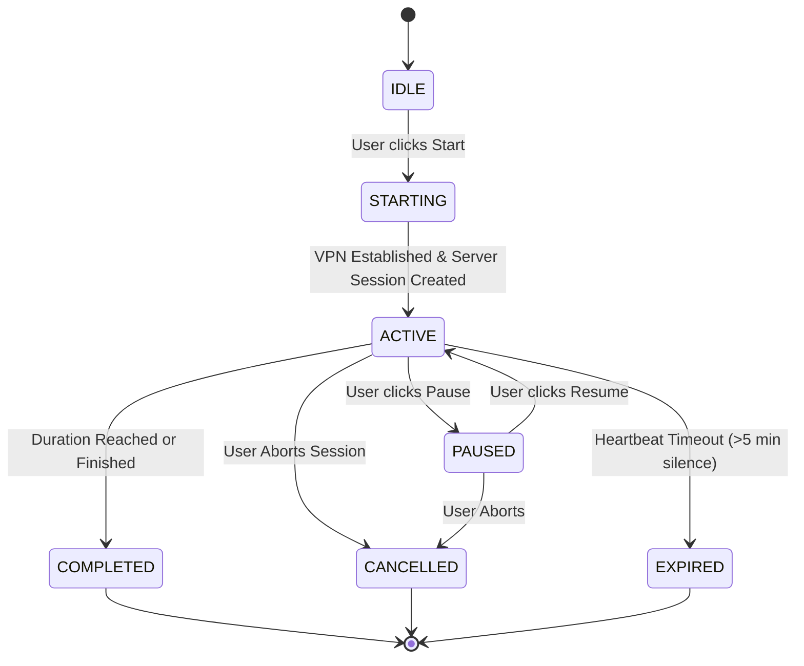

# ProTrack — Rewards, Achievements, Challenges, Focus Shield & Download Product Specification

**Version:** 1.0.0  
**Date:** 2026-09-23  
**Architecture Author:** Antigravity Engineering  
**Target Platform:** Web (Vite + React) & Android (Capacitor + Native Java Service)  

---

## 1. System Vision & Core Product Loop

ProTrack's motivation system is not a decorative badge page or an ad-reward coin gimmick. It is an **integrated academic habit-reinforcement engine** that converts authentic student effort into a verifiable study record:

$$\text{Study Action} \longrightarrow \text{Server Event Validation} \longrightarrow \text{XP Ledger} \longrightarrow \text{Challenge Progress} \longrightarrow \text{Trophy Unlock} \longrightarrow \text{Lifelong Record}$$

### Core Invariants:
1. **Zero Client Authority:** The client cannot self-award XP or claim achievements by dispatching `{ xp: 1000, unlock: true }`.
2. **No Fake Gamification:** No casino wheels, no infinite confetti bursts, no cartoon avatars. The aesthetic is modern academic, disciplined, and calm.
3. **Idempotent Event Ingestion:** The same action (e.g. completing a specific CBT or Pomodoro) cannot yield duplicate XP or trophy rewards.
4. **Physical Reality Focus:** Focus Shield restricts selected distracting apps on Android using local-only network filtering without traffic surveillance or remote routing.

---

## 2. Feature Specifications

### A. Rewards Model & Central Event Engine
The backend implements a single, transactional event processing pipeline:
`study_events -> reward_ledger -> user_challenges -> user_achievements -> user_profiles`

#### Supported Event Types:
- `POMODORO_COMPLETED`: Parameters: `{ sessionId, verifiedMinutes, subject }`
- `TASK_COMPLETED`: Parameters: `{ taskId, subject, priority }`
- `CBT_COMPLETED`: Parameters: `{ attemptId, examId, score, accuracy, totalQuestions }`
- `QUESTION_SOLVED`: Parameters: `{ questionId, isCorrect, subject }`
- `FLASHCARD_REVIEWED`: Parameters: `{ cardId, rating, box }`
- `CHAPTER_COMPLETED`: Parameters: `{ chapterId, subject }`
- `FOCUS_SESSION_COMPLETED`: Parameters: `{ sessionId, verifiedMinutes, blockedAppsCount }`
- `STREAK_CONTINUED`: Parameters: `{ currentStreak, date }`

---

### B. Canonical Achievement & Trophy Model
Achievements are defined with immutable codes, rules, categories, rarities, target values, and XP rewards.

#### Categories:
1. **`FOCUS`**: Deep concentration endurance.
2. **`CONSISTENCY`**: Habit continuity and daily streaks.
3. **`PRACTICE`**: Question volume, CBT exams, and accuracy.
4. **`MASTERY`**: Flashcard active recall and chapter completions.
5. **`SPECIAL`**: Milestones and elite dedication.

#### Rarity Tiers:
- **`COMMON`** (Bronze): Bronze muted styling (+50 XP)
- **`RARE`** (Silver): Silver slate with cyan undertones (+100 XP)
- **`EPIC`** (Gold): Rich warm amber gold (+250 XP)
- **`LEGENDARY`** (Obsidian Violet): Deep violet glow with star particles (+500 XP)

#### Initial Canonical Achievement Catalog (16 Core Trophies):
| Code | Name | Category | Rarity | Rule & Target | XP | Icon |
| :--- | :--- | :--- | :--- | :--- | :--- | :--- |
| `FOCUS_FIRST_STEP` | First Focus | FOCUS | COMMON | Complete 1st Pomodoro (>= 25 min) | +50 | 🥉 |
| `FOCUS_10H` | Deep Concentration | FOCUS | RARE | 600 verified focus minutes | +150 | ⏱️ |
| `FOCUS_50H` | Focus Centurion | FOCUS | EPIC | 3,000 verified focus minutes | +300 | 🛡️ |
| `FOCUS_100H` | Iron Will Master | FOCUS | LEGENDARY | 6,000 verified focus minutes | +600 | 👑 |
| `SHIELD_GUARDIAN` | Focus Guardian | FOCUS | RARE | Complete 3 Focus Shield sessions | +150 | 🛡️ |
| `STREAK_3D` | Ignited Scholar | CONSISTENCY | COMMON | Reach a 3-Day Study Streak | +75 | 🔥 |
| `STREAK_7D` | Unstoppable Momentum | CONSISTENCY | RARE | Reach a 7-Day Study Streak | +150 | ⚡ |
| `STREAK_30D` | Academic Discipline | CONSISTENCY | EPIC | Reach a 30-Day Study Streak | +400 | 🏆 |
| `CBT_FIRST_TEST` | Exam Ready | PRACTICE | COMMON | Complete 1 full CBT attempt | +50 | 📝 |
| `CBT_PERFECT` | Bullseye Mastery | PRACTICE | EPIC | Score >= 90% accuracy on a CBT (min 20 Qs) | +350 | 🎯 |
| `QUESTIONS_100` | Problem Solver | PRACTICE | COMMON | Solve 100 questions correctly | +100 | 🧠 |
| `QUESTIONS_500` | Question Titan | PRACTICE | EPIC | Solve 500 questions correctly | +350 | ⚡ |
| `TASKS_10` | Organized Aspirant | MASTERY | COMMON | Complete 10 study tasks | +75 | 📋 |
| `TASKS_50` | Task Smasher | MASTERY | RARE | Complete 50 study tasks | +200 | ⚔️ |
| `CARDS_50` | Active Recall Pro | MASTERY | COMMON | Review 50 flashcards | +75 | 🃏 |
| `EARLY_BIRD` | Dawn Scholar | SPECIAL | RARE | Complete a study session before 7:00 AM IST | +150 | 🌅 |

---

### C. Challenge System (Dynamic & Exam-Specific)
Challenges refresh daily and weekly, querying the student's selected exam context.

#### 1. Daily Challenges (Reset 00:00 IST):
- **Daily Focus Sprint:** Complete 45 minutes of focused study (Target: 45 min, +30 XP).
- **Daily Question Drill:** Solve 15 questions in Practice Hub or CBT (Target: 15 Qs, +40 XP).
- **Daily Task Master:** Complete 2 tasks from your study plan (Target: 2 tasks, +25 XP).

#### 2. Weekly Challenges (Reset Monday 00:00 IST):
- **Weekly Deep Focus Marathon:** Accumulate 300 verified focus minutes (Target: 300 min, +150 XP).
- **Weekly Mock Benchmark:** Complete 2 full CBT practice sessions (Target: 2 CBTs, +120 XP).
- **Weekly Active Recall:** Review 40 flashcards (Target: 40 cards, +80 XP).

#### 3. Exam-Specific Challenges:
- **NEET Aspirant:** *"Complete 2 Biology topic tests this week."*
- **UPSC Aspirant:** *"Complete 2 GS Polity/History tests this week."*
- **SSC CGL Aspirant:** *"Solve 30 Quantitative Aptitude questions."*

---

### D. Trophy Collection UI (My Collection)
Located under the **Rewards** tab:
1. **Header Overview Bar:**
   - Total XP & Level with progress bar.
   - Unlocked Trophy count (e.g. `6 / 16 Unlocked`).
   - Active Streak & Total Verified Focus Hours.
2. **Category Tabs:** `All`, `Focus`, `Consistency`, `Practice`, `Mastery`, `Special`.
3. **Trophy Cards:**
   - **Locked:** Muted dark slate styling, grayscale icon, current progress bar (e.g. `320 / 600 min`).
   - **Unlocked:** Vibrant border glow matching rarity, colorful icon, unlock date, XP badge.
4. **Trophy Inspection Modal:**
   - Detailed history: When unlocked, how achieved, student's personal record, XP awarded.

---

### E. XP & Leveling Formula
$$\text{Level} = \left\lfloor \frac{\text{Total XP}}{200} \right\rfloor + 1$$
Every action generates a transparent record in `reward_ledger`.

---

### F. Focus Shield & Native Android Network Filter
Feature Name: **Focus Shield**  
Tagline: *"Protect your study time by restricting distracting apps."*

#### User Experience Flow:
1. Student opens **Focus Shield** (via dedicated top navigation or More hub).
2. Chooses duration: `25 min`, `50 min`, `90 min`, or `Custom`.
3. Selects apps to restrict:
   - [x] YouTube (`com.google.android.youtube`)
   - [x] Instagram (`com.instagram.android`)
   - [ ] Facebook (`com.facebook.katana`)
   - [ ] Snapchat (`com.snapchat.android`)
   - [ ] Reddit (`com.reddit.frontpage`)
   - [ ] X / Twitter (`com.twitter.android`)
4. Clicks **"Start Focus Session"**.
5. Clear Trust Disclosure:
   > *"Focus Shield uses an on-device network filter to pause internet access for selected distracting apps during your session. ProTrack runs 100% locally on your phone and never intercepts your private messages, passwords, or browsing data."*
6. On Android:
   - Prepares `VpnService.prepare()`.
   - Starts `FocusShieldVpnService` with foreground notification.
   - Selected apps lose internet connectivity. ProTrack and essential study tools maintain uninterrupted high-speed internet.
7. Focus Session timer runs with server heartbeats.

---

### G. Focus Session State Machine


#### Server Invariants:
- `verified_seconds = sum(unbroken_intervals)`.
- If a session is cancelled after 12 minutes of a 60-minute target, server awards exactly 12 verified minutes.

---

### H. Achievement Unlock Modal Animation
A reusable, 60 FPS mobile-optimized component (`AchievementUnlockModal`):
- Background dim with soft backdrop blur (`backdrop-blur-md`).
- Trophy scales in smoothly (`scale: 0.85 -> 1.0`, ease-out cubic).
- Subtle rarity aura / particle burst.
- Headline: *"Achievement Unlocked"*.
- Trophy Name & Category pill.
- Requirement description & `+XP` badge.
- Dual actions: `[ View Collection ]` and `[ Continue ]`.
- Respects `prefers-reduced-motion` (instant opacity fade, no heavy transforms).
- Queueing: If multiple achievements trigger in a single event, they display sequentially with clean transitions.

---

### I. Download Page (`/download`)
1. **Standalone Route:** Accessible on web at `/download` and via navigation.
2. **Hero:** *"Take ProTrack With You — Study anywhere. Practice anywhere. Stay focused."*
3. **Android Section:**
   - Badge: Version 2.4.2 (Verified Production Build).
   - Features List: CBT Exam Engine, Spaced Repetition Flashcards, Pomodoro Study Timer, Focus Shield Distraction Blocker, Offline-Friendly.
   - Primary Button: `Download Android App (.apk)` linking directly to canonical `/protrack.apk`.
   - File details: Size ~11.3 MB, SHA-256 verified, signed release.
4. **Desktop QR Section:**
   - Crisp SVG/Canvas QR Code pointing to `https://aspirantx.vercel.app/protrack.apk`.
   - *"Scan with phone camera to download directly."*
5. **iOS Section:**
   - Clearly states *"iOS Version — In Development (Coming Soon)"*.
6. **Trust & Privacy Section:**
   - Substantive technical facts: On-device local VPN filtering, zero data selling, server-authoritative study records.

---

## 3. Database Schema Specification (Neon PostgreSQL)

### 3.1 `achievements` (Static Definitions)
```sql
CREATE TABLE IF NOT EXISTS public.achievements (
  id VARCHAR(64) PRIMARY KEY,
  code VARCHAR(64) UNIQUE NOT NULL,
  name VARCHAR(128) NOT NULL,
  description TEXT NOT NULL,
  category VARCHAR(32) NOT NULL,
  rarity VARCHAR(32) NOT NULL DEFAULT 'COMMON',
  icon VARCHAR(32) NOT NULL,
  target_value NUMERIC NOT NULL,
  unit VARCHAR(32) NOT NULL,
  xp_reward INTEGER NOT NULL DEFAULT 50,
  created_at TIMESTAMPTZ NOT NULL DEFAULT NOW()
);
```

### 3.2 `user_achievements` (User Progress & Unlocks)
```sql
CREATE TABLE IF NOT EXISTS public.user_achievements (
  id VARCHAR(64) PRIMARY KEY,
  user_id UUID NOT NULL REFERENCES public.user_profiles(id) ON DELETE CASCADE,
  achievement_id VARCHAR(64) NOT NULL REFERENCES public.achievements(id) ON DELETE CASCADE,
  current_value NUMERIC NOT NULL DEFAULT 0,
  target_value NUMERIC NOT NULL,
  is_unlocked BOOLEAN NOT NULL DEFAULT FALSE,
  unlocked_at TIMESTAMPTZ,
  progress_updated_at TIMESTAMPTZ NOT NULL DEFAULT NOW(),
  CONSTRAINT uq_user_achievement UNIQUE (user_id, achievement_id)
);
```

### 3.3 `challenges` & `user_challenges` (Daily/Weekly Tasks)
```sql
CREATE TABLE IF NOT EXISTS public.challenges (
  id VARCHAR(64) PRIMARY KEY,
  code VARCHAR(64) UNIQUE NOT NULL,
  title VARCHAR(128) NOT NULL,
  description TEXT NOT NULL,
  frequency VARCHAR(32) NOT NULL, -- 'DAILY', 'WEEKLY', 'MILESTONE'
  target_value NUMERIC NOT NULL,
  unit VARCHAR(32) NOT NULL,
  xp_reward INTEGER NOT NULL DEFAULT 30,
  exam_id VARCHAR(64) DEFAULT 'ALL',
  is_active BOOLEAN NOT NULL DEFAULT TRUE,
  created_at TIMESTAMPTZ NOT NULL DEFAULT NOW()
);

CREATE TABLE IF NOT EXISTS public.user_challenges (
  id VARCHAR(64) PRIMARY KEY,
  user_id UUID NOT NULL REFERENCES public.user_profiles(id) ON DELETE CASCADE,
  challenge_id VARCHAR(64) NOT NULL REFERENCES public.challenges(id) ON DELETE CASCADE,
  period_key VARCHAR(32) NOT NULL, -- e.g., '2026-09-23' for daily, '2026-W39' for weekly
  current_value NUMERIC NOT NULL DEFAULT 0,
  target_value NUMERIC NOT NULL,
  is_completed BOOLEAN NOT NULL DEFAULT FALSE,
  completed_at TIMESTAMPTZ,
  xp_awarded BOOLEAN NOT NULL DEFAULT FALSE,
  updated_at TIMESTAMPTZ NOT NULL DEFAULT NOW(),
  CONSTRAINT uq_user_challenge_period UNIQUE (user_id, challenge_id, period_key)
);
```

### 3.4 `focus_sessions` (Durable Anti-Cheat State Machine)
```sql
CREATE TABLE IF NOT EXISTS public.focus_sessions (
  id VARCHAR(64) PRIMARY KEY,
  user_id UUID NOT NULL REFERENCES public.user_profiles(id) ON DELETE CASCADE,
  requested_minutes INTEGER NOT NULL,
  verified_minutes INTEGER NOT NULL DEFAULT 0,
  blocked_apps JSONB NOT NULL DEFAULT '[]'::jsonb,
  status VARCHAR(32) NOT NULL DEFAULT 'ACTIVE', -- 'ACTIVE', 'PAUSED', 'COMPLETED', 'CANCELLED'
  started_at TIMESTAMPTZ NOT NULL DEFAULT NOW(),
  last_heartbeat_at TIMESTAMPTZ NOT NULL DEFAULT NOW(),
  resumed_at TIMESTAMPTZ,
  paused_at TIMESTAMPTZ,
  completed_at TIMESTAMPTZ,
  created_at TIMESTAMPTZ NOT NULL DEFAULT NOW(),
  updated_at TIMESTAMPTZ NOT NULL DEFAULT NOW()
);
```

### 3.5 `reward_events` & `reward_ledger` (Idempotent Event Log)
```sql
CREATE TABLE IF NOT EXISTS public.reward_events (
  id VARCHAR(64) PRIMARY KEY,
  user_id UUID NOT NULL REFERENCES public.user_profiles(id) ON DELETE CASCADE,
  event_type VARCHAR(64) NOT NULL,
  reference_id VARCHAR(128) NOT NULL,
  event_payload JSONB NOT NULL DEFAULT '{}'::jsonb,
  processed_at TIMESTAMPTZ NOT NULL DEFAULT NOW(),
  CONSTRAINT uq_user_event_ref UNIQUE (user_id, event_type, reference_id)
);

CREATE TABLE IF NOT EXISTS public.reward_ledger (
  id VARCHAR(64) PRIMARY KEY,
  user_id UUID NOT NULL REFERENCES public.user_profiles(id) ON DELETE CASCADE,
  xp_change INTEGER NOT NULL,
  balance_after INTEGER NOT NULL,
  source VARCHAR(64) NOT NULL,
  reference_id VARCHAR(128),
  description TEXT,
  created_at TIMESTAMPTZ NOT NULL DEFAULT NOW()
);
```

---

## 4. Verification & Testing Protocol

1. **Automated Backend Test Suite (`scripts/test_rewards_focus_engine.ts`):**
   - Event idempotency (submitting same Pomodoro or CBT twice yields 0 additional XP).
   - Challenge incrementation and rollover.
   - Trophy threshold evaluation and exact one-time unlock.
   - Focus session lifecycle (`start -> heartbeat -> pause -> resume -> complete`).
   - Anti-cheat time clipping (attempting to claim 60 min with only 5 min elapsed yields 5 min).
2. **Android Native VpnService Validation:**
   - Per-app routing test: Only `com.google.android.youtube` and `com.instagram.android` are blocked.
   - ProTrack connectivity test: `https://aspirantx.vercel.app/api/health` succeeds while Focus Shield is active.
   - Service shutdown test: Distracting apps recover connectivity cleanly when session ends.
3. **End-to-End Release Build:**
   - `npx tsc --noEmit` -> 0 errors.
   - `npm run build` -> Clean Vite build.
   - `npx cap sync android` -> Asset sync.
   - `./gradlew.bat assembleRelease` -> Signed APK generation.
